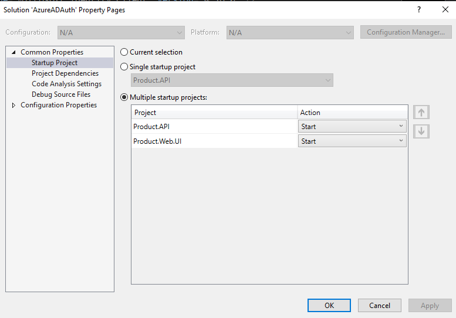
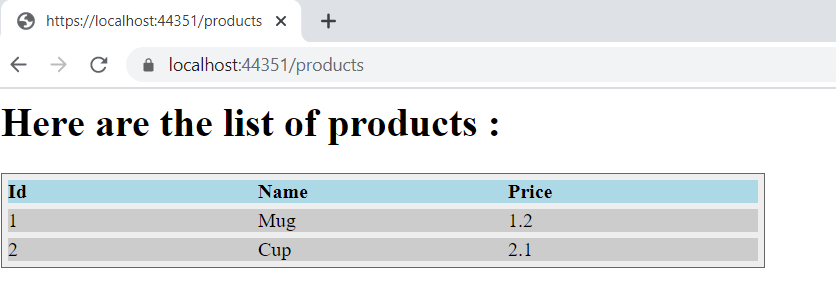
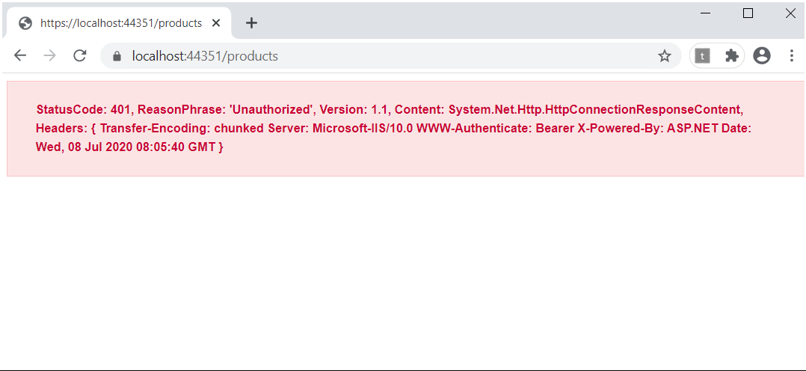

# AzureADAuth
Azure AD authentication related sample. 

***```Prerequisite```*** :

- dotnet core 3.1 
- Visual Studio or VSCode or Dotnet Cli 
- Azure subscriptions
- Postman 

***```Application Facts```*** :

- There are 2 components in this solution : 
    - Prodocut.API (*custom api component*)
    - Product.Web.UI (*web ui component*)

- Technology used - dotnet core 3.1
- Urls :
    - Api Url : https://localhost:44311/api/products
    - Web App : https://localhost:44351/products

- Configurations are kept under *appsettings.json*. 

- Keys are exposed considering it as demo app.But it's not advisable for production purpose.

***```How to run ?```***

- Clone the repository. 
- If you are using Visual Studio, set the solution config for running multiple project at once. 



- You can also run individual project as well.

- Make necessary configuration in Azure following this [article](https://github.com/sughosneo/blogs/blob/master/azure/secure_api_with_azure_ad.md)
- Open the solution in Visual Studio and hit F5
- If everything goes fine. You should see below output. 



- or else you should see respective error message in your browser itself. For e.g :




